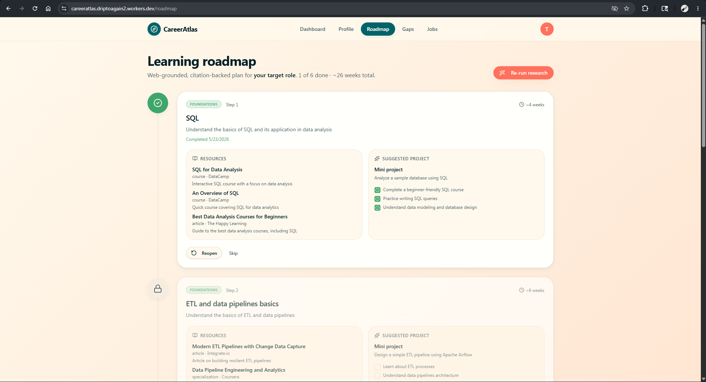
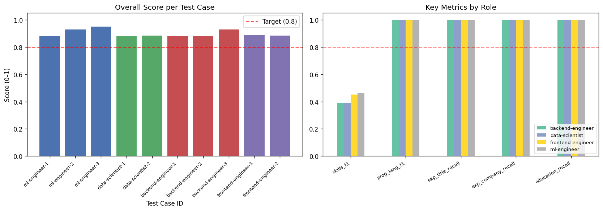
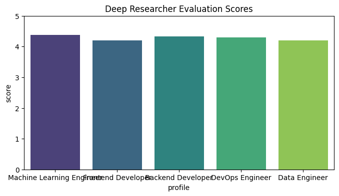

# CareerAtlas

CareerAtlas is an AI-powered personal career planner that parses your resume, identifies skill gaps, constructs a week-by-week learning roadmap, and matches you with tailored jobs in real time.

Pipeline: **profile extraction & switching → gap analysis → learning roadmap → job matches**.

## About The Project

CareerAtlas is designed as a senior career advisor for early-career developers. Instead of generic, one-size-fits-all roadmaps, CareerAtlas connects to your actual professional history.
Through a multi-agent system, the app identifies exactly what skill gaps exist between your current profile and your target career role, retrieves online tutorials/courses to bridge those gaps, and ranks real job postings by skill compatibility.

## Key Features

- **Multi-Resume Support & Profile Selector:** The onboarding process queries all your previously extracted profiles in Supabase, allowing you to select and switch your active profile dynamically or choose to upload/type a new one.
- **Manual Profile Input:** Supports creating or modifying your profile manually with a custom form UI, avoiding forcing you to upload a PDF.
- **GitHub Profile Analysis (evidence-bound):** Connect GitHub via OAuth to infer skills, projects, and coding behavior from your actual repositories (manifest-first file reads + language %s + owner-authored commit stats, forks excluded). Every inferred skill is bound to concrete evidence (a quoted file path or language stat) with a confidence tier; strong matches auto-confirm and the rest are surfaced for review. Only **confirmed** GitHub skills feed your profile, gap analysis, and job matching — quarantined guesses never masquerade as resume truth.
- **Dynamic Skill Gap Analysis (any role):** Semantic taxonomy matching (Pinecone vector retrieval + BM25 + Jina Rerank, with sigmoid-normalized relevance) comparing your skills against a target role to identify critical gaps. Ships with 8 curated tech-role taxonomies; **any other role — unlisted tech or non-technical (marketing, nursing, finance…) — gets an AI-generated skill taxonomy on the fly** (labeled experimental), so the role picker is free-text, not a fixed list.
- **Curated Learning Roadmaps:** Builds week-by-week, resource-linked pathways generated by web-grounded research agents.
- **Ranked Job Matching:** Real-time job indexing powered by Adzuna, ranked using skill overlap, education, experience, and semantic fit.
- **Fault-Tolerant API Rotation:** Features automatic Google API key rotation (supporting 1 to 4 rotatable keys) combined with exponential backoff retries for robust Gemini operations.
- **Custom Theme Engine:** Supports visual personalization (default, sunset, and ocean) using custom OKLCH color palettes.
- **Navigation Guarding:** Secure frontend routing that checks for profile completion and renders a friendly `<NoProfileView />` screen across dashboard, roadmap, and jobs pages if a user has not onboarded.

## Tech Stack

- **Frontend:** React 19, Vite, TanStack Router & Query, Tailwind CSS, Lucide icons, Motion (Framer).
- **Backend:** FastAPI, LangChain, Python 3.12, Uvicorn.
- **Database & Storage:** Supabase (Postgres & Auth), Local storage / Supabase storage for resumes.
- **AI & RAG:** Gemini 2.5 Flash (resume extraction, gap analysis, job reasoning — with 1–4 key rotation + backoff), Groq Llama 3.3 70B (GitHub analysis, deep researcher), Pinecone (skill taxonomy), Jina (rerank), Tavily (search).
- **Deployment:** Backend on **GCP Cloud Run**, frontend on **Cloudflare Workers**, both auto-deployed from `prod` via GitHub Actions. See [`DEPLOYMENT_HANDOFF.md`](DEPLOYMENT_HANDOFF.md).

## Quick Start

### 1. Backend Setup

```bash
cd backend
cp .env.example .env        # then fill in your API keys
uv sync
# Ingest the Pinecone skill taxonomy (required for gap analysis)
uv run python scripts/ingest_taxonomy.py --wipe
# Start the API server
uv run uvicorn app.main:app --reload
```

The backend server will run at `http://localhost:8000`.

### 2. Frontend Setup

```bash
cd frontend
cp .env.example .env        # then fill in your VITE_ variables
bun install                 # or npm install
bun dev                     # or npm run dev
```

The frontend application will run at `http://localhost:8080`.

## Methodology

CareerAtlas employs a specialized **Multi-Agent Architecture** to execute tasks:

1. **Extraction & Matching Agents:** Parse profile contents and compute similarity metrics on indexed jobs.
2. **Gap Analysis & Research Agents:** Query vector stores for relevant skill nodes and plan roadmap phases using Tavily search.
3. **API key Rotator:** Keeps operations running by cycling API keys on failures, shifting from primary to secondary keys transparently.

## Walkthrough

Here is a visual walkthrough of the platform:

### 1. Landing Page


### 2. User Dashboard


### 3. Profile Selector & Extraction


### 4. Work Experience Extraction


### 5. Personal Projects Extraction


### 6. Career Roadmap



### 7. Skill Gap Analysis


### 8. Job Finder


## Evaluation & Benchmarks

Core agents were evaluated using **LLM-as-a-Judge** frameworks to guarantee output quality:

### 1. Gap Analysis Agent

Comparing RAG-augmented extraction (Pinecone + Jina Rerank) against Naive LLM queries proved that our RAG pipeline yields far more context-specific skill suggestions.


### 2. Resume Extraction Agent

Field-level metric testing showed high precision and recall on parsed experiences and skills.


### 3. Deep Researcher Agent

A LangGraph search planner evaluated on curriculum structures verified relevant online roadmap assets.


### 4. Job Hunter Agent

Validated location and role relevance filters on Adzuna results.


## Contributors

- **Tanush Tambe** - Resume Extractor, Job Finder, Evaluation Notebooks
- **Dripto Bhattacharyya** - Deep Researcher, Evaluation, Deployment
- **Sidhaarth Shree** - Gap Analysis Agent, Evaluation
- **G Hamsini** - Contributor
- **Shivanshu Gupta** - Contributor
